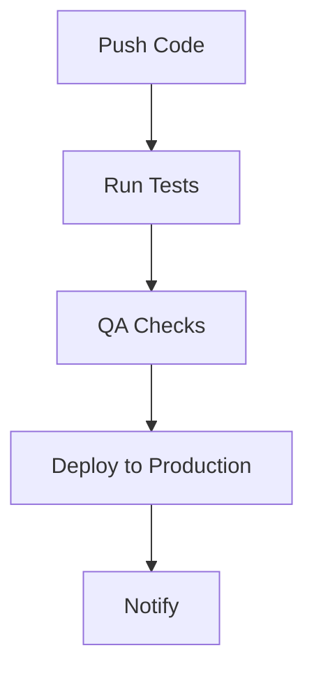

# CI/CD Pipeline

Automated testing and deployment for PriceCheckTN.

## 🎯 Overview

The CI/CD pipeline provides:

- Automated testing on push/pull requests
- Quality assurance checks
- Production deployment
- Continuous integration workflows

## 🚀 Workflow



## 📁 Structure

```
.github/workflows/
└── ci-cd.yml          # GitHub Actions workflow

tests/
├── test_api.py        # API tests
└── qa_checks.py       # Quality assurance checks

scripts/
└── deploy_api.py      # Deployment script

docs/
└── ci-cd.md           # Documentation
```

## 🔧 Setup

The CI/CD pipeline is automatically configured with GitHub Actions.

## 📖 Usage

### Trigger Pipeline

The pipeline runs automatically on:

- Push to `main` branch
- Pull requests to `main` branch

### Manual Testing

```bash
# Run tests locally
python -m pytest tests/test_api.py -v

# Run QA checks
python tests/qa_checks.py

# Test deployment
python scripts/deploy_api.py
```

## 💻 GitHub Actions Usage

The workflow includes:

- **Test Job**: Runs on all pushes/pull requests
- **Deploy Job**: Runs only on main branch pushes

## 🎯 Best Practices

- **Test Coverage**: Maintain comprehensive test coverage
- **QA Checks**: Run quality assurance before deployment
- **Environment Parity**: Match production environment
- **Rollback Plan**: Have rollback procedures
- **Monitoring**: Monitor deployment status

## 🚨 Troubleshooting

### Test Failures

1. Check test logs in GitHub Actions
2. Run tests locally to reproduce
3. Fix failing tests
4. Push changes to trigger new run

### Deployment Issues

1. Check deployment logs
2. Verify environment configuration
3. Test deployment locally
4. Check resource availability

## 📚 Examples

### Complete CI/CD Workflow

```bash
# 1. Make changes and push
git add .
git commit -m "Add new feature"
git push origin main

# 2. Monitor GitHub Actions
# 3. Check deployment status
# 4. Verify production
```

### Local Testing

```bash
# Run complete test suite
python -m pytest tests/ -v

# Run QA checks
python tests/qa_checks.py

# Test deployment
python scripts/deploy_api.py
```

## 🎉 Success Metrics

- ✅ **Automated testing**
- ✅ **Quality assurance**
- ✅ **Production deployment**
- ✅ **Continuous integration**
- ✅ **Zero downtime**