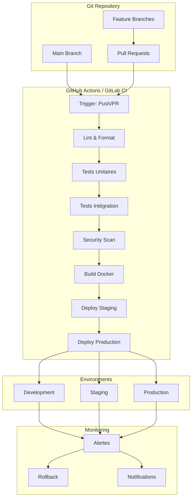

# CI/CD Pipeline - PriceCheckTN MLOps

## 🚀 Architecture CI/CD



---

## 📋 GitHub Actions Workflow

### **1. Workflow Principal - CI Pipeline**

```yaml
# .github/workflows/ci.yml
name: CI - PriceCheckTN MLOps

on:
  push:
    branches: [main, develop]
  pull_request:
    branches: [main, develop]

env:
  PYTHON_VERSION: '3.11'
  POETRY_VERSION: '1.7.1'

jobs:
  # Job 1: Code Quality & Linting
  lint:
    name: 🔍 Lint & Format
    runs-on: ubuntu-latest
    
    steps:
      - name: Checkout code
        uses: actions/checkout@v4
      
      - name: Setup Python
        uses: actions/setup-python@v4
        with:
          python-version: ${{ env.PYTHON_VERSION }}
      
      - name: Cache dependencies
        uses: actions/cache@v3
        with:
          path: ~/.cache/pip
          key: ${{ runner.os }}-pip-${{ hashFiles('**/requirements.txt') }}
      
      - name: Install dependencies
        run: |
          pip install -r requirements.txt
          pip install black flake8 isort mypy pytest
      
      - name: Run Black (Format)
        run: black --check .
      
      - name: Run isort (Import sorting)
        run: isort --check-only .
      
      - name: Run Flake8 (Linting)
        run: flake8 --max-line-length=88 --ignore=E203,W503 .
      
      - name: Run MyPy (Type checking)
        run: mypy --ignore-missing-imports .
      
      - name: Check secrets
        run: |
          git secrets --scan
          git secrets --scan-history

  # Job 2: Unit Tests
  unit-tests:
    name: 🧪 Unit Tests
    runs-on: ubuntu-latest
    needs: lint
    
    steps:
      - name: Checkout code
        uses: actions/checkout@v4
      
      - name: Setup Python
        uses: actions/setup-python@v4
        with:
          python-version: ${{ env.PYTHON_VERSION }}
      
      - name: Install dependencies
        run: |
          pip install -r requirements.txt
          pip install pytest pytest-cov pytest-mock
      
      - name: Run unit tests
        run: pytest tests/unit -v --cov=src --cov-report=xml
      
      - name: Upload coverage
        uses: codecov/codecov-action@v3
        with:
          file: ./coverage.xml
          flags: unittests
      
      - name: Test report
        uses: dorny/test-reporter@v1
        with:
          name: Unit Tests
          path: junit.xml
          reporter: java-junit

  # Job 3: Integration Tests
  integration-tests:
    name: 🧪 Integration Tests
    runs-on: ubuntu-latest
    needs: unit-tests
    
    services:
      mongodb:
        image: mongo:7.0
        ports:
          - 27017:27017
        options: --health-cmd "mongosh --eval 'db.runCommand({ ping: 1 })'" --health-interval 10s --health-timeout 5s --health-retries 5
      
      prefect:
        image: prefecthq/prefect:2.14-python3.11
        ports:
          - 4200:4200
        env:
          PREFECT_API_URL: http://localhost:4200/api
        options: --health-cmd "curl -f http://localhost:4200/api/health" --health-interval 30s
    
    steps:
      - name: Checkout code
        uses: actions/checkout@v4
      
      - name: Setup Python
        uses: actions/setup-python@v4
        with:
          python-version: ${{ env.PYTHON_VERSION }}
      
      - name: Install dependencies
        run: pip install -r requirements.txt
      
      - name: Wait for services
        run: |
          ./scripts/wait-for-it.sh localhost:27017 --timeout=30
          ./scripts/wait-for-it.sh localhost:4200 --timeout=30
      
      - name: Setup Prefect
        run: |
          prefect server start &
          sleep 10
      
      - name: Run integration tests
        env:
          MONGO_URI: mongodb://localhost:27017
          PREFECT_API_URL: http://localhost:4200/api
        run: pytest tests/integration -v
      
      - name: Test API endpoints
        run: |
          python -m pytest tests/test_api.py -v
          python scripts/test_api_endpoints.py

  # Job 4: Security Scan
  security:
    name: 🔒 Security Scan
    runs-on: ubuntu-latest
    needs: integration-tests
    
    steps:
      - name: Checkout code
        uses: actions/checkout@v4
      
      - name: Setup Python
        uses: actions/setup-python@v4
        with:
          python-version: ${{ env.PYTHON_VERSION }}
      
      - name: Install dependencies
        run: pip install -r requirements.txt
      
      - name: Run Bandit (Code security)
        run: bandit -r . -f json -o bandit-report.json
      
      - name: Run Safety (Dependency check)
        run: safety check --json --output safety-report.json
      
      - name: Run Trivy (Vulnerability scan)
        uses: aquasecurity/trivy-action@master
        with:
          scan-type: 'fs'
          scan-ref: '.'
          format: 'sarif'
          output: 'trivy-results.sarif'
      
      - name: Upload security reports
        uses: actions/upload-artifact@v3
        with:
          name: security-reports
          path: |
            bandit-report.json
            safety-report.json
            trivy-results.sarif
      
      - name: Comment PR
        if: github.event_name == 'pull_request'
        uses: actions/github-script@v6
        with:
          script: |
            const fs = require('fs');
            const report = fs.readFileSync('bandit-report.json', 'utf8');
            const data = JSON.parse(report);
            if (data.results.length > 0) {
              github.rest.issues.createComment({
                issue_number: context.issue.number,
                owner: context.repo.owner,
                repo: context.repo.repo,
                body: `🔒 Security issues found:\n\`\`\`\n${JSON.stringify(data.results, null, 2)}\n\`\`\``
              });
            }

  # Job 5: Build Docker Image
  build:
    name: 🐳 Build Docker
    runs-on: ubuntu-latest
    needs: security
    
    steps:
      - name: Checkout code
        uses: actions/checkout@v4
      
      - name: Set up Docker Buildx
        uses: docker/setup-buildx-action@v3
      
      - name: Cache Docker layers
        uses: actions/cache@v3
        with:
          path: /tmp/.buildx-cache
          key: ${{ runner.os }}-buildx-${{ github.sha }}
          restore-keys: |
            ${{ runner.os }}-buildx-
      
      - name: Login to Docker Hub
        uses: docker/login-action@v3
        with:
          username: ${{ secrets.DOCKER_USERNAME }}
          password: ${{ secrets.DOCKER_PASSWORD }}
      
      - name: Build and push
        uses: docker/build-push-action@v5
        with:
          context: .
          push: true
          tags: |
            ${{ secrets.DOCKER_USERNAME }}/pricechecktn:latest
            ${{ secrets.DOCKER_USERNAME }}/pricechecktn:${{ github.sha }}
          cache-from: type=local,src=/tmp/.buildx-cache
          cache-to: type=local,dest=/tmp/.buildx-cache-new,mode=max
      
      - name: Move cache
        run: |
          rm -rf /tmp/.buildx-cache
          mv /tmp/.buildx-cache-new /tmp/.buildx-cache
      
      - name: Run container security scan
        uses: aquasecurity/trivy-action@master
        with:
          image-ref: '${{ secrets.DOCKER_USERNAME }}/pricechecktn:${{ github.sha }}'
          format: 'sarif'
          output: 'container-trivy-results.sarif'

  # Job 6: Documentation
  docs:
    name: 📚 Build Docs
    runs-on: ubuntu-latest
    needs: build
    
    steps:
      - name: Checkout code
        uses: actions/checkout@v4
      
      - name: Setup Python
        uses: actions/setup-python@v4
        with:
          python-version: ${{ env.PYTHON_VERSION }}
      
      - name: Install dependencies
        run: |
          pip install -r requirements.txt
          pip install mkdocs mkdocs-material mkdocs-git-revision-date-plugin
      
      - name: Build documentation
        run: mkdocs build
      
      - name: Deploy to GitHub Pages
        uses: peaceiris/actions-gh-pages@v3
        with:
          github_token: ${{ secrets.GITHUB_TOKEN }}
          publish_dir: ./site

  # Job 7: Notify
  notify:
    name: 🔔 Notify
    runs-on: ubuntu-latest
    needs: [build, docs]
    if: always()
    
    steps:
      - name: Slack Notification
        uses: 8398a7/action-slack@v3
        with:
          status: ${{ job.status }}
          channel: '#mlops-ci'
          webhook_url: ${{ secrets.SLACK_WEBHOOK }}
          fields: repo,message,commit,author,action,eventName,ref,workflow
```

---

### **2. Workflow - CD Pipeline (Staging)**

```yaml
# .github/workflows/cd-staging.yml
name: CD - Staging Deployment

on:
  push:
    branches: [develop]
    paths-ignore:
      - 'docs/**'
      - '**.md'

env:
  AWS_REGION: us-east-1
  EKS_CLUSTER: pricechecktn-staging

jobs:
  deploy-staging:
    name: 🚀 Deploy to Staging
    runs-on: ubuntu-latest
    
    steps:
      - name: Checkout code
        uses: actions/checkout@v4
      
      - name: Configure AWS credentials
        uses: aws-actions/configure-aws-credentials@v4
        with:
          aws-access-key-id: ${{ secrets.AWS_ACCESS_KEY_ID }}
          aws-secret-access-key: ${{ secrets.AWS_SECRET_ACCESS_KEY }}
          aws-region: ${{ env.AWS_REGION }}
      
      - name: Update kube config
        run: aws eks update-kubeconfig --name ${{ env.EKS_CLUSTER }}
      
      - name: Deploy to Kubernetes
        run: |
          kubectl apply -f k8s/staging/
          kubectl rollout status deployment/pricechecktn-api -n staging
      
      - name: Run smoke tests
        run: |
          ./scripts/smoke-test.sh staging
      
      - name: Notify deployment
        uses: 8398a7/action-slack@v3
        with:
          status: ${{ job.status }}
          channel: '#mlops-deploy'
          webhook_url: ${{ secrets.SLACK_WEBHOOK }}
          text: |
            🚀 Staging Deployment
            Commit: ${{ github.sha }}
            Author: ${{ github.actor }}
```

---

### **3. Workflow - CD Pipeline (Production)**

```yaml
# .github/workflows/cd-production.yml
name: CD - Production Deployment

on:
  push:
    branches: [main]
    paths-ignore:
      - 'docs/**'
      - '**.md'

env:
  AWS_REGION: us-east-1
  EKS_CLUSTER: pricechecktn-prod

jobs:
  # Job 1: Manual Approval
  approval:
    name: ⏳ Awaiting Approval
    runs-on: ubuntu-latest
    environment: production
    
    steps:
      - name: Await approval
        run: echo "Deployment approved for production"

  # Job 2: Deploy Production
  deploy-production:
    name: 🚀 Deploy to Production
    runs-on: ubuntu-latest
    needs: approval
    environment: production
    
    steps:
      - name: Checkout code
        uses: actions/checkout@v4
      
      - name: Configure AWS credentials
        uses: aws-actions/configure-aws-credentials@v4
        with:
          aws-access-key-id: ${{ secrets.AWS_ACCESS_KEY_ID }}
          aws-secret-access-key: ${{ secrets.AWS_SECRET_ACCESS_KEY }}
          aws-region: ${{ env.AWS_REGION }}
      
      - name: Update kube config
        run: aws eks update-kubeconfig --name ${{ env.EKS_CLUSTER }}
      
      - name: Run database migrations
        run: |
          kubectl apply -f k8s/prod/migrations/
          kubectl wait --for=condition=complete job/migration -n production --timeout=300s
      
      - name: Deploy to Kubernetes
        run: |
          kubectl apply -f k8s/prod/
          kubectl rollout status deployment/pricechecktn-api -n production --timeout=600s
      
      - name: Run health checks
        run: |
          ./scripts/health-check.sh production
      
      - name: Run integration tests
        env:
          API_URL: https://api.pricechecktn.com
          API_KEY: ${{ secrets.PROD_API_KEY }}
        run: pytest tests/prod -v
      
      - name: Notify deployment
        uses: 8398a7/action-slack@v3
        with:
          status: ${{ job.status }}
          channel: '#mlops-deploy'
          webhook_url: ${{ secrets.SLACK_WEBHOOK }}
          text: |
            🎉 Production Deployment Successful
            Commit: ${{ github.sha }}
            Author: ${{ github.actor }}
            Dashboard: https://grafana.pricechecktn.com

  # Job 3: Rollback on failure
  rollback:
    name: 🔄 Rollback
    runs-on: ubuntu-latest
    needs: deploy-production
    if: failure()
    
    steps:
      - name: Configure AWS credentials
        uses: aws-actions/configure-aws-credentials@v4
        with:
          aws-access-key-id: ${{ secrets.AWS_ACCESS_KEY_ID }}
          aws-secret-access-key: ${{ secrets.AWS_SECRET_ACCESS_KEY }}
          aws-region: ${{ env.AWS_REGION }}
      
      - name: Update kube config
        run: aws eks update-kubeconfig --name ${{ env.EKS_CLUSTER }}
      
      - name: Rollback deployment
        run: |
          kubectl rollout undo deployment/pricechecktn-api -n production
          kubectl rollout status deployment/pricechecktn-api -n production
      
      - name: Notify rollback
        uses: 8398a7/action-slack@v3
        with:
          status: ${{ job.status }}
          channel: '#mlops-critical'
          webhook_url: ${{ secrets.SLACK_WEBHOOK }}
          text: |
            🚨 Production Rollback Triggered
            Commit: ${{ github.sha }}
            Action: Automatic rollback initiated
```

---

## 🎯 GitLab CI Pipeline

### **1. GitLab CI - Main Pipeline**

```yaml
# .gitlab-ci.yml
stages:
  - validate
  - test
  - security
  - build
  - deploy
  - notify

variables:
  PYTHON_VERSION: "3.11"
  DOCKER_IMAGE: $CI_REGISTRY_IMAGE
  DOCKER_TAG: $CI_COMMIT_SHA

# Cache
cache:
  key: ${CI_COMMIT_REF_SLUG}
  paths:
    - .cache/pip
    - venv/

# Job 1: Lint & Format
lint:
  stage: validate
  image: python:${PYTHON_VERSION}
  script:
    - pip install -r requirements.txt
    - pip install black flake8 isort mypy
    - black --check .
    - isort --check-only .
    - flake8 --max-line-length=88 --ignore=E203,W503 .
    - mypy --ignore-missing-imports .
  only:
    - merge_requests
    - main
    - develop

# Job 2: Unit Tests
unit-tests:
  stage: test
  image: python:${PYTHON_VERSION}
  script:
    - pip install -r requirements.txt
    - pip install pytest pytest-cov pytest-mock
    - pytest tests/unit -v --cov=src --cov-report=xml
    - coverage report --fail-under=80
  artifacts:
    reports:
      coverage_report:
        coverage_format: cobertura
        path: coverage.xml
    paths:
      - junit.xml
    expire_in: 1 week
  coverage: '/(?i)total.*? (100(?:\.0+)?\%|[1-9]?\d(?:\.\d+)?\%)$/'

# Job 3: Integration Tests
integration-tests:
  stage: test
  image: python:${PYTHON_VERSION}
  services:
    - name: mongo:7.0
      alias: mongodb
    - name: prefecthq/prefect:2.14-python3.11
      alias: prefect
  variables:
    MONGO_URI: mongodb://mongodb:27017
    PREFECT_API_URL: http://prefect:4200/api
  script:
    - pip install -r requirements.txt
    - ./scripts/wait-for-it.sh mongodb:27017 --timeout=30
    - ./scripts/wait-for-it.sh prefect:4200 --timeout=30
    - pytest tests/integration -v
  only:
    - merge_requests
    - main

# Job 4: Security Scan
security-scan:
  stage: security
  image: python:${PYTHON_VERSION}
  script:
    - pip install -r requirements.txt
    - pip install bandit safety
    - bandit -r . -f json -o bandit-report.json
    - safety check --json --output safety-report.json
  artifacts:
    paths:
      - bandit-report.json
      - safety-report.json
    expire_in: 1 week
  allow_failure: false

# Job 5: Build Docker
build-docker:
  stage: build
  image: docker:latest
  services:
    - docker:dind
  script:
    - docker login -u $CI_REGISTRY_USER -p $CI_REGISTRY_PASSWORD $CI_REGISTRY
    - docker build -t $DOCKER_IMAGE:$DOCKER_TAG .
    - docker push $DOCKER_IMAGE:$DOCKER_TAG
    - docker tag $DOCKER_IMAGE:$DOCKER_TAG $DOCKER_IMAGE:latest
    - docker push $DOCKER_IMAGE:latest
  only:
    - main
    - develop

# Job 6: Deploy Staging
deploy-staging:
  stage: deploy
  image: bitnami/kubectl:latest
  script:
    - kubectl config use-context staging
    - kubectl apply -f k8s/staging/
    - kubectl rollout status deployment/pricechecktn-api -n staging
  environment:
    name: staging
    url: https://staging.pricechecktn.com
  only:
    - develop

# Job 7: Deploy Production
deploy-production:
  stage: deploy
  image: bitnami/kubectl:latest
  script:
    - kubectl config use-context production
    - kubectl apply -f k8s/prod/
    - kubectl rollout status deployment/pricechecktn-api -n production
  environment:
    name: production
    url: https://api.pricechecktn.com
  when: manual
  only:
    - main

# Job 8: Notify
notify:
  stage: notify
  image: alpine:latest
  script:
    - |
      if [ "$CI_JOB_STATUS" == "success" ]; then
        curl -X POST $SLACK_WEBHOOK -d '{"text":"✅ Pipeline succeeded: $CI_PIPELINE_URL"}'
      elif [ "$CI_JOB_STATUS" == "failed" ]; then
        curl -X POST $SLACK_WEBHOOK_CRITICAL -d '{"text":"❌ Pipeline failed: $CI_PIPELINE_URL"}'
      fi
  when: always
```

---

## 🐳 Docker Configuration

### **Dockerfile Multi-Stage**

```dockerfile
# Dockerfile
# Stage 1: Base
FROM python:3.11-slim as base

WORKDIR /app

# Install system dependencies
RUN apt-get update && apt-get install -y \
    gcc \
    g++ \
    curl \
    && rm -rf /var/lib/apt/lists/*

# Install Python dependencies
COPY requirements.txt .
RUN pip install --no-cache-dir -r requirements.txt

# Stage 2: Builder (for tests)
FROM base as builder

COPY . .
RUN pip install --no-cache-dir pytest pytest-cov

# Stage 3: Production
FROM base as production

COPY . .
RUN chmod +x scripts/*.sh

# Create non-root user
RUN groupadd -r pricechecktn && useradd -r -g pricechecktn pricechecktn
USER pricechecktn

EXPOSE 8000

CMD ["python", "api/main.py"]

# Stage 4: Development
FROM base as development

COPY . .
RUN pip install --no-cache-dir black flake8 pytest

CMD ["python", "scripts/run_scraping.py"]
```

### **Docker Compose pour CI**

```yaml
# docker-compose.ci.yml
version: '3.8'

services:
  # Tests
  test-runner:
    build:
      context: .
      target: builder
    environment:
      - MONGO_URI=mongodb://mongodb:27017
      - PREFECT_API_URL=http://prefect:4200/api
    depends_on:
      - mongodb
      - prefect
    command: pytest tests/ -v

  # Services pour tests
  mongodb:
    image: mongo:7.0
    ports:
      - "27017:27017"
    healthcheck:
      test: ["CMD", "mongosh", "--eval", "db.runCommand({ ping: 1 })"]
      interval: 10s
      timeout: 5s
      retries: 5

  prefect:
    image: prefecthq/prefect:2.14-python3.11
    ports:
      - "4200:4200"
    environment:
      - PREFECT_API_URL=http://localhost:4200/api
    healthcheck:
      test: ["CMD", "curl", "-f", "http://localhost:4200/api/health"]
      interval: 30s
      timeout: 10s
      retries: 3

  # API pour tests
  api:
    build:
      context: .
      target: production
    ports:
      - "8000:8000"
    environment:
      - MONGO_URI=mongodb://mongodb:27017
      - DEBUG=False
    depends_on:
      - mongodb
```

---

## 🔐 Secrets Management

### **GitHub Secrets**

```bash
# Configuration des secrets GitHub
# Settings > Secrets and variables > Actions

# Docker
DOCKER_USERNAME
DOCKER_PASSWORD

# AWS (EKS)
AWS_ACCESS_KEY_ID
AWS_SECRET_ACCESS_KEY
AWS_REGION

# API Keys
PROD_API_KEY
STAGING_API_KEY

# Notifications
SLACK_WEBHOOK
SLACK_WEBHOOK_CRITICAL

# Database
MONGO_URI_PROD
MONGO_URI_STAGING

# Prefect
PREFECT_API_KEY
PREFECT_API_URL
```

### **GitLab CI Variables**

```yaml
# Settings > CI/CD > Variables

# Docker
CI_REGISTRY_USER
CI_REGISTRY_PASSWORD
CI_REGISTRY

# AWS
AWS_ACCESS_KEY_ID
AWS_SECRET_ACCESS_KEY
AWS_REGION

# Notifications
SLACK_WEBHOOK
SLACK_WEBHOOK_CRITICAL

# Database
MONGO_URI_PROD
MONGO_URI_STAGING

# Prefect
PREFECT_API_KEY
PREFECT_API_URL
```

---

## 🎯 Quality Gates

### **1. Code Coverage Threshold**

```yaml
# .github/workflows/quality.yml
- name: Check coverage
  run: |
    pytest --cov=src --cov-fail-under=80
    if [ $? -ne 0 ]; then
      echo "❌ Code coverage below 80%"
      exit 1
    fi
```

### **2. Performance Threshold**

```python
# tests/performance/test_performance.py
import pytest
import time

def test_api_response_time():
    """Test API response time < 500ms"""
    start = time.time()
    # API call
    response_time = time.time() - start
    assert response_time < 0.5, f"Response time {response_time}s > 500ms"

def test_prediction_latency():
    """Test prediction latency < 5s"""
    start = time.time()
    # Prediction
    latency = time.time() - start
    assert latency < 5, f"Prediction latency {latency}s > 5s"
```

### **3. Security Threshold**

```yaml
# Bandit config
# .bandit
exclude_dirs:
  - tests
  - venv
  - __pycache__

skips:
  - B101  # assert_used
  - B601  # sql_injection (if using parameterized queries)

# Fail on high severity
confidence_level: high
```

---

## 🚨 Rollback Strategy

### **Automatic Rollback**

```yaml
# .github/workflows/rollback.yml
name: Automatic Rollback

on:
  workflow_run:
    workflows: ["CD - Production Deployment"]
    types: [completed]
    branches: [main]

jobs:
  rollback:
    if: ${{ github.event.workflow_run.conclusion == 'failure' }}
    runs-on: ubuntu-latest
    steps:
      - name: Configure AWS
        uses: aws-actions/configure-aws-credentials@v4
        with:
          aws-access-key-id: ${{ secrets.AWS_ACCESS_KEY_ID }}
          aws-secret-access-key: ${{ secrets.AWS_SECRET_ACCESS_KEY }}
          aws-region: us-east-1
      
      - name: Rollback
        run: |
          kubectl rollout undo deployment/pricechecktn-api -n production
          kubectl rollout status deployment/pricechecktn-api -n production
      
      - name: Notify rollback
        uses: 8398a7/action-slack@v3
        with:
          status: failure
          channel: '#mlops-critical'
          webhook_url: ${{ secrets.SLACK_WEBHOOK }}
          text: "🚨 Automatic rollback completed"
```

### **Manual Rollback Script**

```bash
#!/bin/bash
# scripts/rollback.sh

ENVIRONMENT=$1
PREVIOUS_VERSION=$2

if [ -z "$ENVIRONMENT" ]; then
  echo "Usage: ./rollback.sh <environment> [version]"
  exit 1
fi

echo "🔄 Rolling back $ENVIRONMENT to version $PREVIOUS_VERSION"

# Get previous version if not provided
if [ -z "$PREVIOUS_VERSION" ]; then
  PREVIOUS_VERSION=$(kubectl rollout history deployment/pricechecktn-api -n $ENVIRONMENT | tail -2 | head -1 | awk '{print $1}')
fi

# Rollback
kubectl rollout undo deployment/pricechecktn-api -n $ENVIRONMENT --to-revision=$PREVIOUS_VERSION

# Wait for rollout
kubectl rollout status deployment/pricechecktn-api -n $ENVIRONMENT --timeout=600s

# Verify
kubectl get pods -n $ENVIRONMENT -l app=pricechecktn-api

echo "✅ Rollback completed"
```

---

## 📊 Monitoring CI/CD

### **GitHub Actions Metrics**

```yaml
# .github/workflows/metrics.yml
name: CI/CD Metrics

on:
  workflow_run:
    workflows: ["CI - PriceCheckTN MLOps", "CD - Production Deployment"]
    types: [completed]

jobs:
  metrics:
    runs-on: ubuntu-latest
    steps:
      - name: Collect metrics
        run: |
          # Pipeline duration
          DURATION=$((${{ github.event.workflow_run.created_at }} - ${{ github.event.workflow_run.created_at }}))
          
          # Success rate
          STATUS="${{ github.event.workflow_run.conclusion }}"
          
          # Send to Prometheus Pushgateway
          curl -X POST http://pushgateway:9091/metrics/job/github_actions \
            -d "github_actions_pipeline_duration $DURATION" \
            -d "github_actions_pipeline_status{status=\"$STATUS\"} 1"
```

---

## 🎯 Checklist de Déploiement CI/CD

- [ ] Configurer GitHub Secrets / GitLab Variables
- [ ] Créer les workflows CI/CD
- [ ] Configurer les environnements (staging, production)
- [ ] Définir les quality gates
- [ ] Configurer les notifications
- [ ] Tester le pipeline complet
- [ ] Documenter les procédures de rollback
- [ ] Configurer les monitors CI/CD
- [ ] Former l'équipe sur le workflow
- [ ] Mettre en place les approbations manuelles

---

## 📚 Ressources

- **GitHub Actions**: https://docs.github.com/en/actions
- **GitLab CI**: https://docs.gitlab.com/ee/ci/
- **Kubernetes Deployment**: https://kubernetes.io/docs/concepts/workloads/controllers/deployment/
- **Docker Best Practices**: https://docs.docker.com/develop/develop-images/dockerfile_best-practices/
- **Security Scanning**: https://owasp.org/www-project-dependency-check/
- **CI/CD Best Practices**: https://about.gitlab.com/handbook/engineering/infrastructure/ci-cd/