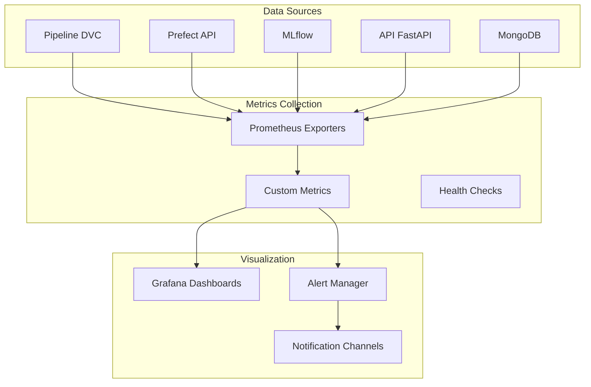

# Monitoring & Observability - PriceCheckTN MLOps

## 📊 Architecture de Monitoring



---

## 🎯 Métriques Clés à Surveiller

### **1. Pipeline Metrics (DVC + Prefect)**

| Métrique | Type | Seuil d'Alerte | Description |
|----------|------|----------------|-------------|
| `pipeline_duration_seconds` | Histogram | > 3600s | Durée totale du pipeline |
| `scraping_success_rate` | Gauge | < 95% | Taux de succès des scrapers |
| `products_consolidated` | Counter | < 100 | Nombre de produits consolidés |
| `matching_accuracy` | Gauge | < 80% | Précision du matching |
| `prediction_latency` | Histogram | > 5s | Latence des prédictions |

### **2. Model Metrics (MLflow)**

| Métrique | Type | Seuil d'Alerte | Description |
|----------|------|----------------|-------------|
| `model_accuracy` | Gauge | < 0.85 | Précision du modèle |
| `model_drift` | Gauge | > 0.15 | Détection de drift |
| `training_time` | Histogram | > 7200s | Temps d'entraînement |
| `inference_latency` | Histogram | > 2s | Latence d'inférence |

### **3. API Metrics (FastAPI)**

| Métrique | Type | Seuil d'Alerte | Description |
|----------|------|----------------|-------------|
| `api_requests_total` | Counter | - | Nombre total de requêtes |
| `api_error_rate` | Gauge | > 5% | Taux d'erreurs API |
| `api_response_time` | Histogram | > 500ms | Temps de réponse API |
| `api_concurrent_users` | Gauge | > 100 | Utilisateurs concurrents |

### **4. Data Quality Metrics**

| Métrique | Type | Seuil d'Alerte | Description |
|----------|------|----------------|-------------|
| `data_completeness` | Gauge | < 90% | Complétude des données |
| `data_freshness` | Gauge | > 24h | Fraîcheur des données |
| `duplicate_rate` | Gauge | > 5% | Taux de doublons |
| `invalid_records` | Counter | > 100 | Enregistrements invalides |

---

## 🎨 Tableaux de Bord Grafana

### **Dashboard 1: Vue d'Ensemble MLOps**

```json
{
  "dashboard": {
    "title": "PriceCheckTN - MLOps Overview",
    "panels": [
      {
        "title": "Pipeline Status",
        "type": "stat",
        "targets": [{"expr": "pipeline_success_rate"}],
        "thresholds": {"mode": "absolute", "steps": [{"color": "red", "value": 0}, {"color": "yellow", "value": 95}, {"color": "green", "value": 99}]}
      },
      {
        "title": "Active Models",
        "type": "stat",
        "targets": [{"expr": "count(mlflow_model_versions)"}]
      },
      {
        "title": "Daily Predictions",
        "type": "graph",
        "targets": [{"expr": "rate(prediction_total[24h])"}]
      },
      {
        "title": "API Health",
        "type": "stat",
        "targets": [{"expr": "api_uptime"}],
        "thresholds": {"steps": [{"color": "red", "value": 0}, {"color": "green", "value": 99}]}
      }
    ]
  }
}
```

### **Dashboard 2: Performance & Latency**

```json
{
  "dashboard": {
    "title": "PriceCheckTN - Performance Metrics",
    "panels": [
      {
        "title": "Pipeline Duration",
        "type": "graph",
        "targets": [
          {"expr": "histogram_quantile(0.95, pipeline_duration_seconds)"},
          {"expr": "histogram_quantile(0.50, pipeline_duration_seconds)"}
        ]
      },
      {
        "title": "Scraping Performance",
        "type": "graph",
        "targets": [
          {"expr": "rate(scraping_success_rate[5m])"},
          {"expr": "scraping_items_per_second"}
        ]
      },
      {
        "title": "Model Inference Latency",
        "type": "heatmap",
        "targets": [{"expr": "prediction_latency_bucket"}]
      },
      {
        "title": "API Response Times",
        "type": "graph",
        "targets": [
          {"expr": "histogram_quantile(0.95, api_response_time)"},
          {"expr": "histogram_quantile(0.99, api_response_time)"}
        ]
      }
    ]
  }
}
```

### **Dashboard 3: Data Quality**

```json
{
  "dashboard": {
    "title": "PriceCheckTN - Data Quality",
    "panels": [
      {
        "title": "Data Completeness",
        "type": "gauge",
        "targets": [{"expr": "data_completeness"}],
        "thresholds": {"steps": [{"color": "red", "value": 0}, {"color": "yellow", "value": 90}, {"color": "green", "value": 95}]}
      },
      {
        "title": "Duplicate Rate",
        "type": "stat",
        "targets": [{"expr": "duplicate_rate"}],
        "thresholds": {"steps": [{"color": "green", "value": 0}, {"color": "yellow", "value": 5}, {"color": "red", "value": 10}]}
      },
      {
        "title": "Data Freshness",
        "type": "stat",
        "targets": [{"expr": "time() - data_last_update"}],
        "thresholds": {"steps": [{"color": "green", "value": 0}, {"color": "yellow", "value": 86400}, {"color": "red", "value": 172800}]}
      }
    ]
  }
}
```

---

## 🔔 Système d'Alertes

### **Alertes Critiques (PagerDuty)**

```yaml
groups:
  - name: mlops_critical
    interval: 1m
    rules:
      - alert: PipelineFailed
        expr: pipeline_success_rate < 1
        for: 5m
        labels:
          severity: critical
          team: mlops
        annotations:
          summary: "Pipeline MLOps en échec"
          description: "Le pipeline PriceCheckTN a échoué sur l'étape {{ $labels.stage }}"
          
      - alert: ModelDriftDetected
        expr: model_drift > 0.15
        for: 10m
        labels:
          severity: critical
          team: data-science
        annotations:
          summary: "Détection de drift sur le modèle"
          description: "Le modèle {{ $labels.model }} présente un drift de {{ $labels.drift_value }}"
          
      - alert: APIHighErrorRate
        expr: api_error_rate > 0.05
        for: 5m
        labels:
          severity: critical
          team: platform
        annotations:
          summary: "Taux d'erreurs API élevé"
          description: "Taux d'erreurs API à {{ $value }}%"
```

### **Alertes Warning (Slack)**

```yaml
groups:
  - name: mlops_warning
    interval: 5m
    rules:
      - alert: ScrapingPerformanceDegraded
        expr: scraping_success_rate < 95
        for: 15m
        labels:
          severity: warning
          team: data-engineering
        annotations:
          summary: "Performance de scraping dégradée"
          description: "Taux de succès à {{ $value }}%"
          
      - alert: HighLatency
        expr: prediction_latency > 5
        for: 10m
        labels:
          severity: warning
          team: platform
        annotations:
          summary: "Latence élevée détectée"
          description: "Latence moyenne {{ $value }}s"
          
      - alert: DataQualityIssue
        expr: data_completeness < 90
        for: 20m
        labels:
          severity: warning
          team: data-engineering
        annotations:
          summary: "Problème de qualité des données"
          description: "Complétude des données à {{ $value }}%"
```

### **Alertes Info (Email)**

```yaml
groups:
  - name: mlops_info
    interval: 1h
    rules:
      - alert: ModelRetrainingNeeded
        expr: model_age_days > 30
        for: 0m
        labels:
          severity: info
          team: data-science
        annotations:
          summary: "Modèle à re-entraîner"
          description: "Le modèle {{ $labels.model }} a plus de 30 jours"
          
      - alert: DataVolumeAnomaly
        expr: abs(products_consolidated - avg_over_time(products_consolidated[7d])) > 200
        for: 1h
        labels:
          severity: info
          team: data-engineering
        annotations:
          summary: "Anomalie de volume de données"
          description: "Volume anormal détecté"
```

---

## 🚨 Notifications

### **Configuration des Canaux**

```yaml
# Notification Slack
slack_configs:
  - api_url: "https://hooks.slack.com/services/YOUR/WEBHOOK"
    channel: "#mlops-alerts"
    title: "{{ .GroupLabels.alertname }}"
    text: "{{ range .Alerts }}{{ .Annotations.description }}{{ end }}"
    send_resolved: true

# Notification PagerDuty
pagerduty_configs:
  - service_key: "YOUR_PAGERDUTY_KEY"
    description: "{{ .GroupLabels.alertname }}"
    severity: "{{ .CommonLabels.severity }}"
    details:
      summary: "{{ .CommonAnnotations.summary }}"
      description: "{{ .CommonAnnotations.description }}"

# Notification Email
email_configs:
  - to: "mlops-team@company.com"
    subject: "[{{ .Status }}] {{ .GroupLabels.alertname }}"
    body: "{{ range .Alerts }}{{ .Annotations.description }}\n{{ end }}"
```

---

## 📈 Exporters Prometheus

### **1. Custom Exporter Python**

```python
# mlops/monitoring/prometheus_exporter.py
from prometheus_client import Counter, Gauge, Histogram, start_http_server
import time

class MLOpsMetrics:
    def __init__(self):
        # Pipeline metrics
        self.pipeline_duration = Histogram(
            'pipeline_duration_seconds',
            'Duration of pipeline execution',
            buckets=[60, 300, 600, 1800, 3600, 7200]
        )
        
        self.scraping_success = Gauge(
            'scraping_success_rate',
            'Success rate of scraping operations'
        )
        
        self.products_consolidated = Counter(
            'products_consolidated_total',
            'Total number of products consolidated'
        )
        
        # Model metrics
        self.model_accuracy = Gauge(
            'model_accuracy',
            'Current model accuracy',
            ['model_name', 'version']
        )
        
        self.prediction_latency = Histogram(
            'prediction_latency_seconds',
            'Prediction latency',
            buckets=[0.1, 0.5, 1.0, 2.0, 5.0, 10.0]
        )
        
        # API metrics
        self.api_requests = Counter(
            'api_requests_total',
            'Total API requests',
            ['method', 'endpoint', 'status']
        )
        
        self.api_response_time = Histogram(
            'api_response_time_seconds',
            'API response time',
            buckets=[0.01, 0.05, 0.1, 0.5, 1.0, 2.0]
        )
        
        # Data quality metrics
        self.data_completeness = Gauge(
            'data_completeness',
            'Data completeness percentage'
        )
        
        self.duplicate_rate = Gauge(
            'duplicate_rate',
            'Duplicate records rate'
        )

    def record_pipeline_execution(self, duration, success=True):
        self.pipeline_duration.observe(duration)
        if success:
            self.scraping_success.set(100)
        else:
            self.scraping_success.set(0)

    def record_prediction(self, latency, model_name, version):
        self.prediction_latency.observe(latency)
        self.api_requests.labels(
            method='POST',
            endpoint='/predict',
            status='200'
        ).inc()

    def record_api_request(self, method, endpoint, status, duration):
        self.api_requests.labels(
            method=method,
            endpoint=endpoint,
            status=status
        ).inc()
        self.api_response_time.observe(duration)

    def update_data_quality(self, completeness, duplicates):
        self.data_completeness.set(completeness)
        self.duplicate_rate.set(duplicates)

# Start exporter
if __name__ == '__main__':
    start_http_server(8000)
    metrics = MLOpsMetrics()
    # Keep running
    while True:
        time.sleep(1)
```

### **2. Prometheus Configuration**

```yaml
# prometheus.yml
global:
  scrape_interval: 15s
  evaluation_interval: 15s

scrape_configs:
  - job_name: 'mlops-pipeline'
    static_configs:
      - targets: ['localhost:8000']
    metrics_path: '/metrics'
    scrape_interval: 30s

  - job_name: 'prefect'
    static_configs:
      - targets: ['localhost:4200']
    metrics_path: '/metrics'

  - job_name: 'mlflow'
    static_configs:
      - targets: ['localhost:5000']
    metrics_path: '/metrics'

  - job_name: 'fastapi'
    static_configs:
      - targets: ['localhost:8001']
    metrics_path: '/metrics'

  - job_name: 'mongodb'
    static_configs:
      - targets: ['localhost:9216']
    metrics_path: '/metrics'

  - job_name: 'node-exporter'
    static_configs:
      - targets: ['localhost:9100']
    metrics_path: '/metrics'
```

---

## 🐳 Docker Compose pour Monitoring

```yaml
# deployment/docker-compose.monitoring.yml
version: '3.8'

services:
  prometheus:
    image: prom/prometheus:latest
    container_name: prometheus
    ports:
      - "9090:9090"
    volumes:
      - ./prometheus.yml:/etc/prometheus/prometheus.yml
      - prometheus_data:/prometheus
    command:
      - '--config.file=/etc/prometheus/prometheus.yml'
      - '--storage.tsdb.path=/prometheus'
      - '--web.console.libraries=/etc/prometheus/console_libraries'
      - '--web.console.templates=/etc/prometheus/consoles'
      - '--storage.tsdb.retention.time=30d'
      - '--web.enable-lifecycle'
    restart: unless-stopped

  grafana:
    image: grafana/grafana:latest
    container_name: grafana
    ports:
      - "3000:3000"
    environment:
      - GF_SECURITY_ADMIN_PASSWORD=admin123
      - GF_INSTALL_PLUGINS=grafana-piechart-panel
    volumes:
      - grafana_data:/var/lib/grafana
      - ./grafana/dashboards:/etc/grafana/provisioning/dashboards
      - ./grafana/datasources:/etc/grafana/provisioning/datasources
    restart: unless-stopped

  alertmanager:
    image: prom/alertmanager:latest
    container_name: alertmanager
    ports:
      - "9093:9093"
    volumes:
      - ./alertmanager.yml:/etc/alertmanager/alertmanager.yml
      - alertmanager_data:/alertmanager
    command:
      - '--config.file=/etc/alertmanager/alertmanager.yml'
      - '--storage.path=/alertmanager'
    restart: unless-stopped

  node-exporter:
    image: prom/node-exporter:latest
    container_name: node-exporter
    ports:
      - "9100:9100"
    restart: unless-stopped

  mongodb-exporter:
    image: percona/mongodb_exporter:latest
    container_name: mongodb-exporter
    ports:
      - "9216:9216"
    environment:
      - MONGODB_URI=mongodb://mongodb:27017
    restart: unless-stopped

  prometheus-pushgateway:
    image: prom/pushgateway:latest
    container_name: pushgateway
    ports:
      - "9091:9091"
    restart: unless-stopped

volumes:
  prometheus_data:
  grafana_data:
  alertmanager_data:
```

---

## 🎯 Prochaines Étapes

### **Phase 1: Monitoring de Base (Semaine 1)**
1. ✅ Déployer Prometheus + Grafana
2. ✅ Configurer les exporters de base
3. ✅ Créer dashboard "Vue d'Ensemble"
4. ✅ Configurer alertes critiques

### **Phase 2: Monitoring Avancé (Semaine 2)**
1. ✅ Ajouter custom metrics Python
2. ✅ Créer dashboard "Performance"
3. ✅ Configurer alertes warnings
4. ✅ Intégrer notifications Slack

### **Phase 3: Observability Complète (Semaine 3)**
1. ✅ Dashboard "Data Quality"
2. ✅ Alertes PagerDuty
3. ✅ Tracing avec Jaeger
4. ✅ Logging avec ELK/Loki

### **Phase 4: Auto-scaling (Semaine 4)**
1. ✅ Métriques pour auto-scaling
2. ✅ HPA (Horizontal Pod Autoscaler)
3. ✅ Scaling basé sur la charge
4. ✅ Cost optimization metrics

---

## 📚 Ressources

- **Prometheus Docs**: https://prometheus.io/docs/
- **Grafana Docs**: https://grafana.com/docs/
- **Alertmanager**: https://prometheus.io/docs/alerting/latest/alertmanager/
- **Prefect Monitoring**: https://docs.prefect.io/concepts/monitoring/
- **MLflow Tracking**: https://mlflow.org/docs/latest/tracking.html

---

## 🎯 Checklist de Déploiement

- [ ] Prometheus accessible sur port 9090
- [ ] Grafana accessible sur port 3000 (admin/admin123)
- [ ] Alertmanager accessible sur port 9093
- [ ] Exporters configurés et running
- [ ] Dashboards importés dans Grafana
- [ ] Alertes testées (alertmanager test)
- [ ] Notifications Slack configurées
- [ ] PagerDuty intégré
- [ ] Documentation mise à jour
- [ ] Équipe formée sur les dashboards