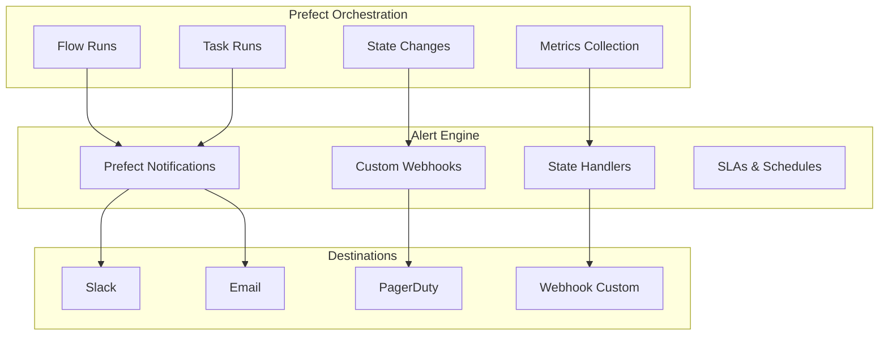

# Alertes Prefect Avancées - PriceCheckTN MLOps

## 🚨 Architecture des Alertes Prefect



---

## 🎯 Types d'Alertes Prefect

### **1. Alertes de Flux (Flow Alerts)**

#### **Flow Failed**
```python
# mlops/orchestration/alerts.py
from prefect import flow
from prefect.blocks.notifications import SlackWebhook
from prefect.states import State

@flow(name="pricechecktn_pipeline")
def pricechecktn_mlops_pipeline():
    # ... pipeline logic ...
    pass

# Configuration d'alerte
def flow_failed_alert(flow: Flow, state: State):
    """Alerte quand un flow échoue"""
    if state.is_failed():
        slack_block = SlackWebhook.load("mlops-alerts")
        slack_block.notify(
            f"🚨 **Flow Failed**: {flow.name}\n"
            f"**State**: {state.name}\n"
            f"**Message**: {state.message}\n"
            f"**Timestamp**: {state.timestamp}\n"
            f"**Run ID**: {state.state_details.flow_run_id}"
        )

# Appliquer au flow
pricechecktn_mlops_pipeline = flow(
    name="pricechecktn_pipeline",
    on_failure=[flow_failed_alert],
    retries=2,
    retry_delay_seconds=60
)(pricechecktn_mlops_pipeline)
```

#### **Flow Timeout**
```python
from prefect import flow
from datetime import timedelta

@flow(
    name="pricechecktn_pipeline",
    timeout_seconds=3600,  # 1 heure max
    on_failure=[flow_failed_alert]
)
def pricechecktn_mlops_pipeline():
    # ... pipeline logic ...
    pass

# Alertes de timeout
def timeout_alert(flow: Flow, state: State):
    """Alerte quand un flow dépasse le timeout"""
    if state.is_failed() and "timeout" in state.message.lower():
        # Envoyer alerte PagerDuty
        pagerduty_alert(
            severity="critical",
            summary=f"Timeout: {flow.name}",
            details={"flow_run_id": state.state_details.flow_run_id}
        )
```

#### **Flow SLA Violation**
```python
from prefect.client.schemas import FlowRun
from prefect.states import State

def sla_violation_handler(flow: Flow, flow_run: FlowRun, state: State):
    """Handler pour violation de SLA"""
    duration = (flow_run.end_time - flow_run.start_time).total_seconds()
    
    if duration > 3600:  # 1 heure
        slack_block = SlackWebhook.load("mlops-alerts")
        slack_block.notify(
            f"⚠️ **SLA Violation**: {flow.name}\n"
            f"**Duration**: {duration}s (max: 3600s)\n"
            f"**Run ID**: {flow_run.id}"
        )

# Appliquer au flow
pricechecktn_mlops_pipeline = flow(
    name="pricechecktn_pipeline",
    on_failure=[flow_failed_alert],
    on_completion=[sla_violation_handler]
)(pricechecktn_mlops_pipeline)
```

---

### **2. Alertes de Tâches (Task Alerts)**

#### **Task Failed**
```python
from prefect import task, flow
from prefect.blocks.notifications import SlackWebhook

@task(
    name="scrape_mytek",
    retries=3,
    retry_delay_seconds=30,
    on_failure=[task_failed_alert]
)
def scrape_mytek():
    # ... scraping logic ...
    pass

def task_failed_alert(task: Task, state: State):
    """Alerte quand une tâche échoue"""
    if state.is_failed():
        slack_block = SlackWebhook.load("mlops-alerts")
        slack_block.notify(
            f"❌ **Task Failed**: {task.name}\n"
            f"**Message**: {state.message}\n"
            f"**Retries**: {state.state_details.task_run_info.retry_count}"
        )
```

#### **Task Slowdown**
```python
from prefect import task
import time

@task(name="prediction_task")
def prediction_task(reviews):
    start_time = time.time()
    # ... prediction logic ...
    duration = time.time() - start_time
    
    # Alert si trop lent
    if duration > 5:
        slack_block = SlackWebhook.load("mlops-alerts")
        slack_block.notify(
            f"🐌 **Slow Task**: prediction_task\n"
            f"**Duration**: {duration}s (threshold: 5s)\n"
            f"**Reviews**: {len(reviews)}"
        )
    
    return results
```

---

### **3. Alertes de Données (Data Quality Alerts)**

#### **Data Volume Anomaly**
```python
from prefect import flow, task
from prefect.blocks.notifications import SlackWebhook
import pandas as pd

@task(name="check_data_volume")
def check_data_volume(products_df: pd.DataFrame):
    """Vérifie le volume de données"""
    expected_min = 300
    expected_max = 500
    
    actual = len(products_df)
    
    if actual < expected_min or actual > expected_max:
        slack_block = SlackWebhook.load("mlops-alerts")
        slack_block.notify(
            f"📊 **Data Volume Anomaly**\n"
            f"**Expected**: {expected_min}-{expected_max}\n"
            f"**Actual**: {actual}\n"
            f"**Delta**: {actual - expected_min} / {actual - expected_max}"
        )
        return False
    
    return True

@flow(name="data_validation")
def data_validation_flow():
    products = load_products()
    is_valid = check_data_volume(products)
    
    if not is_valid:
        raise ValueError("Data volume anomaly detected")
```

#### **Data Quality Score**
```python
@task(name="calculate_data_quality")
def calculate_data_quality(df: pd.DataFrame) -> dict:
    """Calcule le score de qualité des données"""
    quality_score = {
        "completeness": 1 - df.isnull().sum().sum() / (len(df) * len(df.columns)),
        "validity": 1 - (df == "invalid").sum().sum() / (len(df) * len(df.columns)),
        "consistency": 1 - df.duplicated().sum() / len(df)
    }
    
    # Alert si score bas
    if quality_score["completeness"] < 0.9:
        slack_block = SlackWebhook.load("mlops-alerts")
        slack_block.notify(
            f"⚠️ **Low Data Quality**\n"
            f"**Completeness**: {quality_score['completeness']:.2%}\n"
            f"**Validity**: {quality_score['validity']:.2%}\n"
            f"**Consistency**: {quality_score['consistency']:.2%}"
        )
    
    return quality_score
```

---

### **4. Alertes de Modèle (Model Alerts)**

#### **Model Drift Detection**
```python
from prefect import task, flow
from prefect.blocks.notifications import SlackWebhook
import numpy as np

@task(name="detect_model_drift")
def detect_model_drift(current_metrics: dict, baseline_metrics: dict):
    """Détecte le drift du modèle"""
    drift_threshold = 0.15
    
    drift_score = np.mean([
        abs(current_metrics[k] - baseline_metrics[k]) / baseline_metrics[k]
        for k in baseline_metrics.keys()
    ])
    
    if drift_score > drift_threshold:
        slack_block = SlackWebhook.load("mlops-alerts")
        slack_block.notify(
            f"🌊 **Model Drift Detected**\n"
            f"**Drift Score**: {drift_score:.2%}\n"
            f"**Threshold**: {drift_threshold:.2%}\n"
            f"**Action**: Model retraining required"
        )
        
        # Trigger retraining
        retrain_model_flow()
    
    return drift_score

@flow(name="model_monitoring")
def model_monitoring_flow():
    current_metrics = get_current_model_metrics()
    baseline_metrics = get_baseline_metrics()
    
    drift_score = detect_model_drift(current_metrics, baseline_metrics)
    return drift_score
```

#### **Model Performance Degradation**
```python
@task(name="check_model_performance")
def check_model_performance(current_accuracy: float):
    """Vérifie la performance du modèle"""
    baseline_accuracy = 0.85
    degradation_threshold = 0.05
    
    if current_accuracy < baseline_accuracy - degradation_threshold:
        slack_block = SlackWebhook.load("mlops-alerts")
        slack_block.notify(
            f"📉 **Model Performance Degradation**\n"
            f"**Baseline**: {baseline_accuracy:.2%}\n"
            f"**Current**: {current_accuracy:.2%}\n"
            f"**Degradation**: {baseline_accuracy - current_accuracy:.2%}\n"
            f"**Action**: Model retraining recommended"
        )
        return False
    
    return True
```

---

### **5. Alertes de Performance (Performance Alerts)**

#### **Pipeline Duration**
```python
from prefect import flow
from datetime import datetime, timedelta

@flow(name="pricechecktn_pipeline")
def pricechecktn_mlops_pipeline():
    start_time = datetime.now()
    
    # ... pipeline logic ...
    
    duration = (datetime.now() - start_time).total_seconds()
    
    # Alert si trop long
    if duration > 3600:  # 1 heure
        slack_block = SlackWebhook.load("mlops-alerts")
        slack_block.notify(
            f"⏱️ **Slow Pipeline**\n"
            f"**Duration**: {duration}s (max: 3600s)\n"
            f"**Action**: Investigate performance"
        )
```

#### **Scraping Performance**
```python
@task(name="scraping_performance_monitor")
def scraping_performance_monitor(scraping_results: dict):
    """Monitor scraping performance"""
    success_rate = scraping_results["success"] / scraping_results["total"]
    avg_time_per_item = scraping_results["total_time"] / scraping_results["success"]
    
    if success_rate < 0.95:
        slack_block = SlackWebhook.load("mlops-alerts")
        slack_block.notify(
            f"🕸️ **Scraping Performance Issue**\n"
            f"**Success Rate**: {success_rate:.2%}\n"
            f"**Avg Time**: {avg_time_per_item:.2f}s/item\n"
            f"**Failed**: {scraping_results['failed']}"
        )
```

---

## 🔧 Configuration des Notifications

### **1. Slack Webhook Block**

```python
# mlops/orchestration/notification_blocks.py
from prefect.blocks.notifications import SlackWebhook

def setup_slack_alerts():
    """Configure Slack webhook for alerts"""
    
    # Webhook pour alertes critiques
    slack_critical = SlackWebhook(
        url="https://hooks.slack.com/services/YOUR/WEBHOOK/URL",
        payload={
            "channel": "#mlops-critical",
            "username": "PriceCheckTN Alert Bot",
            "icon_emoji": ":rotating_light:",
            "attachments": [
                {
                    "color": "danger",
                    "fields": [
                        {"title": "Severity", "value": "CRITICAL", "short": True},
                        {"title": "Environment", "value": "production", "short": True}
                    ]
                }
            ]
        }
    )
    slack_critical.save("mlops-critical", overwrite=True)
    
    # Webhook pour alertes warning
    slack_warning = SlackWebhook(
        url="https://hooks.slack.com/services/YOUR/WEBHOOK/URL",
        payload={
            "channel": "#mlops-warnings",
            "username": "PriceCheckTN Warning Bot",
            "icon_emoji": ":warning:"
        }
    )
    slack_warning.save("mlops-warnings", overwrite=True)
    
    # Webhook pour notifications info
    slack_info = SlackWebhook(
        url="https://hooks.slack.com/services/YOUR/WEBHOOK/URL",
        payload={
            "channel": "#mlops-info",
            "username": "PriceCheckTN Info Bot",
            "icon_emoji": ":information_source:"
        }
    )
    slack_info.save("mlops-info", overwrite=True)

# Utilisation dans les flows
from prefect.blocks.notifications import SlackWebhook

def notify_failure(flow, state):
    slack = SlackWebhook.load("mlops-critical")
    slack.notify(f"Flow {flow.name} failed: {state.message}")
```

### **2. Email Notifications**

```python
from prefect.blocks.notifications import Email

def setup_email_alerts():
    """Configure email notifications"""
    
    # Email pour équipe MLOps
    email_mlops = Email(
        recipients=["mlops-team@company.com"],
        subject_template="[CRITICAL] PriceCheckTN Alert",
        body_template="Alert: {alert_message}"
    )
    email_mlops.save("mlops-email", overwrite=True)

# Utilisation
from prefect.blocks.notifications import Email

def notify_by_email(message):
    email = Email.load("mlops-email")
    email.notify(message)
```

### **3. PagerDuty Integration**

```python
import requests
from prefect import task

@task(name="pagerduty_alert")
def pagerduty_alert(severity: str, summary: str, details: dict):
    """Envoyer alerte PagerDuty"""
    
    routing_key = "YOUR_PAGERDUTY_ROUTING_KEY"
    
    payload = {
        "routing_key": routing_key,
        "event_action": "trigger",
        "payload": {
            "summary": summary,
            "severity": severity,  # critical, error, warning, info
            "source": "pricechecktn-mlops",
            "component": "pipeline",
            "group": "mlops",
            "class": "pipeline-execution",
            "custom_details": details
        }
    }
    
    response = requests.post(
        "https://events.pagerduty.com/v2/enqueue",
        json=payload
    )
    
    return response.status_code == 202

# Utilisation
def flow_failed_alert(flow, state):
    pagerduty_alert(
        severity="critical",
        summary=f"Pipeline failed: {flow.name}",
        details={
            "flow_run_id": state.state_details.flow_run_id,
            "error_message": state.message,
            "timestamp": str(state.timestamp)
        }
    )
```

---

## 🎯 Alertes Spécifiques PriceCheckTN

### **Alerte 1: Scraping Failure**

```python
@task(name="scrape_mytek", on_failure=[scraping_failure_alert])
def scrape_mytek():
    # ... scraping logic ...
    pass

def scraping_failure_alert(task: Task, state: State):
    """Alerte spécifique pour échec de scraping"""
    slack = SlackWebhook.load("mlops-critical")
    
    # Analyser le type d'erreur
    error_msg = state.message.lower()
    
    if "timeout" in error_msg:
        action = "Augmenter le timeout ou vérifier le site"
    elif "403" in error_msg or "401" in error_msg:
        action = "Vérifier les credentials ou utiliser proxy"
    elif "connection" in error_msg:
        action = "Vérifier la connectivité réseau"
    else:
        action = "Investiguer le code du scraper"
    
    slack.notify(
        f"🕸️ **Scraping Failure**: {task.name}\n"
        f"**Error**: {state.message}\n"
        f"**Action**: {action}\n"
        f"**Run ID**: {state.state_details.task_run_info.id}"
    )
```

### **Alerte 2: Matching Quality**

```python
@task(name="product_matching", on_completion=[matching_quality_alert])
def product_matching():
    # ... matching logic ...
    return {"matches": 0, "confidence": 0.0}

def matching_quality_alert(task: Task, state: State):
    """Alerte si matching de mauvaise qualité"""
    if state.is_completed():
        result = state.result()
        
        if result["matches"] == 0:
            slack = SlackWebhook.load("mlops-warnings")
            slack.notify(
                f"🔍 **No Product Matches Found**\n"
                f"**Confidence**: {result['confidence']:.2%}\n"
                f"**Action**: Vérifier l'algorithme de matching"
            )
        
        elif result["confidence"] < 0.7:
            slack = SlackWebhook.load("mlops-warnings")
            slack.notify(
                f"⚠️ **Low Matching Confidence**\n"
                f"**Confidence**: {result['confidence']:.2%}\n"
                f"**Matches**: {result['matches']}"
            )
```

### **Alerte 3: Prediction Quality**

```python
@task(name="prediction_quality_check")
def prediction_quality_check(predictions_df):
    """Vérifie la qualité des prédictions"""
    
    # Vérifier distribution des scores
    fake_scores = predictions_df["fake_score"]
    
    # Alert si distribution anormale
    if fake_scores.mean() > 0.9 or fake_scores.mean() < 0.1:
        slack = SlackWebhook.load("mlops-warnings")
        slack.notify(
            f"📊 **Prediction Distribution Anomaly**\n"
            f"**Mean Score**: {fake_scores.mean():.3f}\n"
            f"**Expected**: 0.3-0.7\n"
            f"**Action**: Vérifier le modèle ou les données"
        )
    
    # Alert si trop de faux positifs/négatifs
    high_confidence = len(predictions_df[predictions_df["fake_score"] > 0.95])
    if high_confidence > len(predictions_df) * 0.1:
        slack = SlackWebhook.load("mlops-warnings")
        slack.notify(
            f"⚠️ **Too Many High Confidence Predictions**\n"
            f"**Count**: {high_confidence}/{len(predictions_df)}\n"
            f"**Percentage**: {high_confidence/len(predictions_df):.1%}"
        )
```

---

## 📊 Dashboard Prefect

### **1. Custom Dashboard avec Prefect UI**

```python
# mlops/orchestration/prefect_dashboard.py
from prefect import flow
from prefect.input import RunInput
from prefect.blocks.notifications import SlackWebhook

@flow(name="dashboard_alert_manager")
def dashboard_alert_manager():
    """Dashboard pour gérer les alertes"""
    
    # Récupérer les derniers runs
    from prefect.client import get_client
    
    async with get_client() as client:
        flow_runs = await client.read_flow_runs(
            flow_name="pricechecktn_pipeline",
            limit=10
        )
    
    # Analyser les patterns
    failed_runs = [run for run in flow_runs if run.state.is_failed()]
    slow_runs = [run for run in flow_runs if run.duration > 3600]
    
    # Envoyer rapport
    if failed_runs or slow_runs:
        slack = SlackWebhook.load("mlops-info")
        slack.notify(
            f"📊 **Daily MLOps Report**\n"
            f"**Total Runs**: {len(flow_runs)}\n"
            f"**Failed**: {len(failed_runs)}\n"
            f"**Slow**: {len(slow_runs)}\n"
            f"**Success Rate**: {(len(flow_runs) - len(failed_runs))/len(flow_runs):.1%}"
        )
```

### **2. Alert Aggregation**

```python
# mlops/orchestration/alert_aggregator.py
from prefect import flow, task
from prefect.blocks.notifications import SlackWebhook
from datetime import datetime, timedelta

@task(name="aggregate_alerts")
def aggregate_alerts(time_window_minutes: int = 60):
    """Agrège les alertes sur une fenêtre temporelle"""
    
    from prefect.client import get_client
    
    async with get_client() as client:
        # Récupérer les alertes
        flow_runs = await client.read_flow_runs(
            limit=100
        )
    
    # Filtrer sur la fenêtre
    cutoff_time = datetime.utcnow() - timedelta(minutes=time_window_minutes)
    
    recent_failures = [
        run for run in flow_runs 
        if run.state.is_failed() and run.end_time > cutoff_time
    ]
    
    # Si trop d'alertes, envoyer résumé
    if len(recent_failures) > 3:
        slack = SlackWebhook.load("mlops-critical")
        slack.notify(
            f"🚨 **Alert Storm Detected**\n"
            f"**Failures in last {time_window_minutes}min**: {len(recent_failures)}\n"
            f"**Action**: System-wide investigation needed"
        )

@flow(name="alert_monitoring")
def alert_monitoring():
    """Flow de monitoring des alertes"""
    while True:
        aggregate_alerts(60)
        import time
        time.sleep(300)  # Check toutes les 5 minutes
```

---

## 🎯 SLA (Service Level Agreements)

### **Définition des SLAs**

```python
# mlops/orchestration/sla_config.py
SLA_CONFIG = {
    "pipeline": {
        "max_duration": 3600,  # 1 heure
        "max_failures_per_day": 2,
        "min_success_rate": 0.95
    },
    "scraping": {
        "max_duration_per_site": 600,  # 10 minutes
        "min_success_rate": 0.95,
        "max_items_per_minute": 100
    },
    "prediction": {
        "max_latency": 5,  # 5 secondes
        "min_accuracy": 0.85,
        "max_batch_size": 1000
    },
    "api": {
        "max_response_time": 500,  # 500ms
        "min_uptime": 0.99,
        "max_error_rate": 0.05
    }
}

def check_sla_violation(sla_type: str, actual_value: float):
    """Vérifie si un SLA est violé"""
    config = SLA_CONFIG.get(sla_type, {})
    
    if not config:
        return False
    
    threshold = config.get("max_duration") or config.get("min_success_rate")
    
    if "max" in str(config.keys()):
        return actual_value > threshold
    else:
        return actual_value < threshold
```

---

## 🚀 Déploiement des Alertes

### **Étape 1: Configurer les Blocks Prefect**

```bash
# Configurer Slack Webhook
prefect block register -m prefect.blocks.notifications.SlackWebhook

# Configurer Email
prefect block register -m prefect.blocks.notifications.Email
```

### **Étape 2: Créer les Blocks via Python**

```python
# scripts/setup_alerts.py
from prefect.blocks.notifications import SlackWebhook, Email

def setup_all_alerts():
    """Configure tous les blocks d'alertes"""
    
    # Slack Critical
    SlackWebhook(
        url="https://hooks.slack.com/services/YOUR/WEBHOOK"
    ).save("mlops-critical", overwrite=True)
    
    # Slack Warnings
    SlackWebhook(
        url="https://hooks.slack.com/services/YOUR/WEBHOOK"
    ).save("mlops-warnings", overwrite=True)
    
    # Email
    Email(
        recipients=["mlops-team@company.com"]
    ).save("mlops-email", overwrite=True)
    
    print("✅ All alert blocks configured!")

if __name__ == "__main__":
    setup_all_alerts()
```

### **Étape 3: Déployer avec Prefect Deploy**

```python
# mlops/orchestration/deployment.py
from prefect.deployments import Deployment
from prefect.server.schemas.schedules import CronSchedule

def deploy_pipeline_with_alerts():
    """Déployer le pipeline avec alertes configurées"""
    
    deployment = Deployment.build_from_flow(
        flow=pricechecktn_mlops_pipeline,
        name="pricechecktn-pipeline-prod",
        schedule=CronSchedule(cron="0 2 * * *"),  # 2h du matin
        work_pool_name="mlops-pool",
        parameters={},
        infra_overrides={
            "env": {
                "PREFECT_API_URL": "http://localhost:4200/api",
                "PYTHONIOENCODING": "utf-8"
            }
        }
    )
    
    deployment.apply()
    print("✅ Deployment created with alert configuration")

# Appliquer les alertes au flow
pricechecktn_mlops_pipeline = flow(
    name="pricechecktn_pipeline",
    on_failure=[flow_failed_alert],
    on_completion=[flow_completion_alert],
    retries=2,
    retry_delay_seconds=60,
    timeout_seconds=3600
)(pricechecktn_mlops_pipeline)
```

---

## 📈 Rapports d'Alertes

### **Rapport Quotidien**

```python
@flow(name="daily_alert_report")
def daily_alert_report():
    """Génère un rapport quotidien des alertes"""
    
    from prefect.client import get_client
    from datetime import datetime, timedelta
    
    async with get_client() as client:
        # Récupérer les 24 dernières heures
        yesterday = datetime.utcnow() - timedelta(days=1)
        
        flow_runs = await client.read_flow_runs(
            limit=1000,
            # Filtre par date...
        )
    
    # Analyser
    stats = {
        "total_runs": len(flow_runs),
        "failed": len([r for r in flow_runs if r.state.is_failed()]),
        "slow": len([r for r in flow_runs if r.duration > 3600]),
        "avg_duration": sum(r.duration for r in flow_runs) / len(flow_runs)
    }
    
    # Envoyer rapport
    slack = SlackWebhook.load("mlops-info")
    slack.notify(
        f"📊 **Daily MLOps Report**\n"
        f"**Date**: {datetime.utcnow().strftime('%Y-%m-%d')}\n"
        f"**Total Runs**: {stats['total_runs']}\n"
        f"**Failed**: {stats['failed']} ({stats['failed']/stats['total_runs']:.1%})\n"
        f"**Slow**: {stats['slow']}\n"
        f"**Avg Duration**: {stats['avg_duration']:.1f}s"
    )
```

---

## 🎯 Checklist de Déploiement

- [ ] Configurer Slack Webhooks (critical, warnings, info)
- [ ] Configurer Email notifications
- [ ] Configurer PagerDuty integration
- [ ] Créer les blocks Prefect
- [ ] Ajouter handlers aux flows
- [ ] Ajouter handlers aux tâches critiques
- [ ] Configurer SLA monitoring
- [ ] Tester toutes les alertes
- [ ] Documenter les procédures d'escalade
- [ ] Former l'équipe sur les alertes

---

## 📚 Ressources

- **Prefect Notifications**: https://docs.prefect.io/concepts/notifications/
- **Prefect States**: https://docs.prefect.io/concepts/states/
- **Slack Webhooks**: https://api.slack.com/messaging/webhooks
- **PagerDuty Events API**: https://developer.pagerduty.com/docs/events-api-v2/trigger-events/
- **Prometheus Alerting**: https://prometheus.io/docs/prometheus/latest/configuration/alerting_rules/