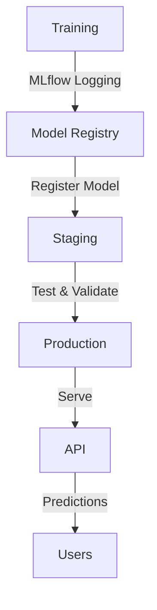

# Model Registry

MLflow-based model registry for PriceCheckTN.

## 🎯 Overview

The Model Registry provides a centralized system for managing machine learning models throughout their lifecycle. It integrates with MLflow to provide versioning, staging, and serving capabilities.

## 📋 Features

- **Model Versioning**: Track different versions of models
- **Stage Management**: Transition models through Staging → Production lifecycle
- **Model Serving**: Load models from registry for API serving
- **CLI Interface**: Command-line tools for model management
- **Fallback Support**: Graceful fallback to local models when registry is unavailable

## 🚀 Workflow



## 📁 Structure

```
mlops/model_registry/
├── __init__.py          # Module initialization
├── registry_client.py   # Core registry functionality
├── serving_utils.py     # Model loading utilities
└── README.md            # Documentation
```

## 🔧 Installation

The model registry is already integrated with the existing MLflow setup. No additional installation is required.

## 📖 Usage

### Register a Model

```python
from mlops.model_registry import get_registry

registry = get_registry()
registry.register_model(
    model_uri="runs:/<run_id>/model",
    name="my_model",
    tags={
        "framework": "pytorch",
        "task": "fake_review_detection"
    },
    description="BERT model for fake review detection"
)
```

### Transition Stages

```python
# Move to staging
registry.transition_stage("my_model", 1, "Staging")

# Promote to production
registry.transition_stage("my_model", 1, "Production")
```

### Load Models for Serving

```python
from mlops.model_registry.serving_utils import load_production_model

# Load production model
model = load_production_model("bert_fake_review_detector")

# Load staging model (for testing)
model = load_staging_model("bert_fake_review_detector")
```

## 💻 CLI Usage

```bash
# List model versions
python scripts/model_registry_cli.py list_versions bert_fake_review_detector

# Transition model stage
python scripts/model_registry_cli.py transition bert_fake_review_detector 1 Production

# Promote staging to production
python scripts/model_registry_cli.py promote bert_fake_review_detector

# Get model info
python scripts/model_registry_cli.py info bert_fake_review_detector

# Archive old versions
python scripts/model_registry_cli.py cleanup bert_fake_review_detector
```

## 🎯 Best Practices

### Model Lifecycle

1. **Training**: Train models and log to MLflow
2. **Registration**: Register successful models in the registry
3. **Staging**: Move models to Staging for testing
4. **Production**: Promote validated models to Production
5. **Archiving**: Archive old versions to keep registry clean

### Version Management

- **Semantic Versioning**: Use meaningful version numbers
- **Descriptive Tags**: Add relevant metadata tags
- **Detailed Descriptions**: Document model purpose and changes
- **Cleanup**: Regularly archive old versions (keep last 3-5)

### API Integration

The API automatically loads models from the registry with fallback:

1. Try Production model
2. Fallback to Staging model
3. Fallback to local files

## 🔄 Integration with Training

The training script (`scripts/train_bert.py`) automatically:

- Logs training runs to MLflow
- Registers models in the registry
- Transitions to Staging stage
- Provides promotion instructions

## 📊 Monitoring

Monitor model performance and usage:

```python
from mlops.model_registry import get_registry

registry = get_registry()
versions = registry.list_model_versions("bert_fake_review_detector")

for version in versions:
    print(f"Version {version.version}: {version.current_stage}")
```

## 🚨 Troubleshooting

### No Models in Registry

If no models are found in the registry:

1. Check MLflow tracking server is running
2. Verify model registration was successful
3. Check experiment names match
4. Use fallback to local models

### Connection Issues

If MLflow server is unavailable:

1. API falls back to local model files
2. Check MLflow server status
3. Verify network connectivity
4. Check configuration settings

## 📚 Examples

### Complete Training to Production Workflow

```bash
# 1. Train model (automatically registers in registry)
python scripts/train_bert.py

# 2. Test the staging model
python scripts/model_registry_cli.py info bert_fake_review_detector

# 3. Promote to production when ready
python scripts/model_registry_cli.py promote bert_fake_review_detector

# 4. API automatically loads production model
uvicorn api.main:app --reload
```

### Model Version Management

```bash
# List all versions
python scripts/model_registry_cli.py list_versions bert_fake_review_detector

# Archive old versions (keep last 3)
python scripts/model_registry_cli.py cleanup bert_fake_review_detector

# Transition specific version
python scripts/model_registry_cli.py transition bert_fake_review_detector 2 Archived
```

## 🎉 Success Metrics

- ✅ **Complete model lifecycle management**
- ✅ **Seamless API integration**
- ✅ **Graceful fallback handling**
- ✅ **Comprehensive CLI tools**
- ✅ **Production-ready workflow**