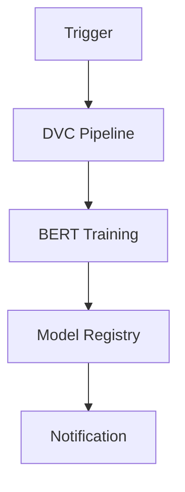

# Pipeline Orchestration

Prefect-based orchestration for PriceCheckTN MLOps workflows.

## 🎯 Overview

The orchestration system manages the complete MLOps pipeline lifecycle:

- Scheduled execution
- Dependency management
- Monitoring and alerts
- Retry logic
- Failure handling

## 🚀 Workflow



## 📁 Structure

```
mlops/orchestration/
├── __init__.py          # Module initialization
├── pipeline.py          # Main pipeline definition
├── deployment.py        # Deployment configuration
├── dashboard.py         # Monitoring dashboard
└── README.md            # Documentation
```

## 🔧 Installation

```bash
pip install prefect
pip install streamlit
```

## 📖 Usage

### Run Pipeline Locally

```bash
python scripts/pipeline_cli.py run
```

### Deploy to Prefect Server

```bash
python scripts/pipeline_cli.py deploy
```

### Launch Monitoring Dashboard

```bash
python scripts/pipeline_cli.py monitor
```

### Check Status

```bash
python scripts/pipeline_cli.py status
```

## 💻 CLI Usage

```bash
# Run pipeline
python scripts/pipeline_cli.py run

# Deploy to server
python scripts/pipeline_cli.py deploy

# Launch dashboard
python scripts/pipeline_cli.py monitor

# Check status
python scripts/pipeline_cli.py status
```

## 🎯 Pipeline Components

### DVC Pipeline Task
- Runs the complete DVC data pipeline
- 2 retries with 30-second delay
- Handles data processing and preparation

### BERT Training Task
- Trains BERT model with MLflow integration
- 1 retry on failure
- Logs training metrics and artifacts

### Model Registry Task
- Promotes successful models to production
- Handles model versioning and staging
- Integrates with MLflow model registry

### Notification Task
- Provides pipeline completion notifications
- Success/failure alerts
- Logging and monitoring

## 🎯 Best Practices

- **Scheduled Execution**: Run daily during low-traffic periods
- **Monitoring**: Set up alerts for pipeline failures
- **Retry Logic**: Configure appropriate retry policies
- **Resource Management**: Monitor resource usage
- **Logging**: Maintain comprehensive logs

## 🚨 Troubleshooting

### Pipeline Failures

1. Check Prefect UI for failure details
2. Review pipeline logs
3. Test individual components
4. Check resource availability

### Connection Issues

1. Verify Prefect server status
2. Check network connectivity
3. Validate API credentials
4. Review configuration settings

### Deployment Issues

1. Check work pool configuration
2. Verify agent connectivity
3. Review deployment logs
4. Validate schedule syntax

## 📚 Examples

### Complete Pipeline Workflow

```bash
# 1. Run pipeline locally for testing
python scripts/pipeline_cli.py run

# 2. Deploy to Prefect server
python scripts/pipeline_cli.py deploy

# 3. Monitor pipeline runs
python scripts/pipeline_cli.py monitor

# 4. Check pipeline status
python scripts/pipeline_cli.py status
```

### Manual Pipeline Execution

```bash
# Run specific components manually
python mlops/orchestration/pipeline.py
```

## 🎉 Success Metrics

- ✅ **Complete pipeline orchestration**
- ✅ **Scheduled execution**
- ✅ **Comprehensive monitoring**
- ✅ **Retry and error handling**
- ✅ **Production-ready deployment**